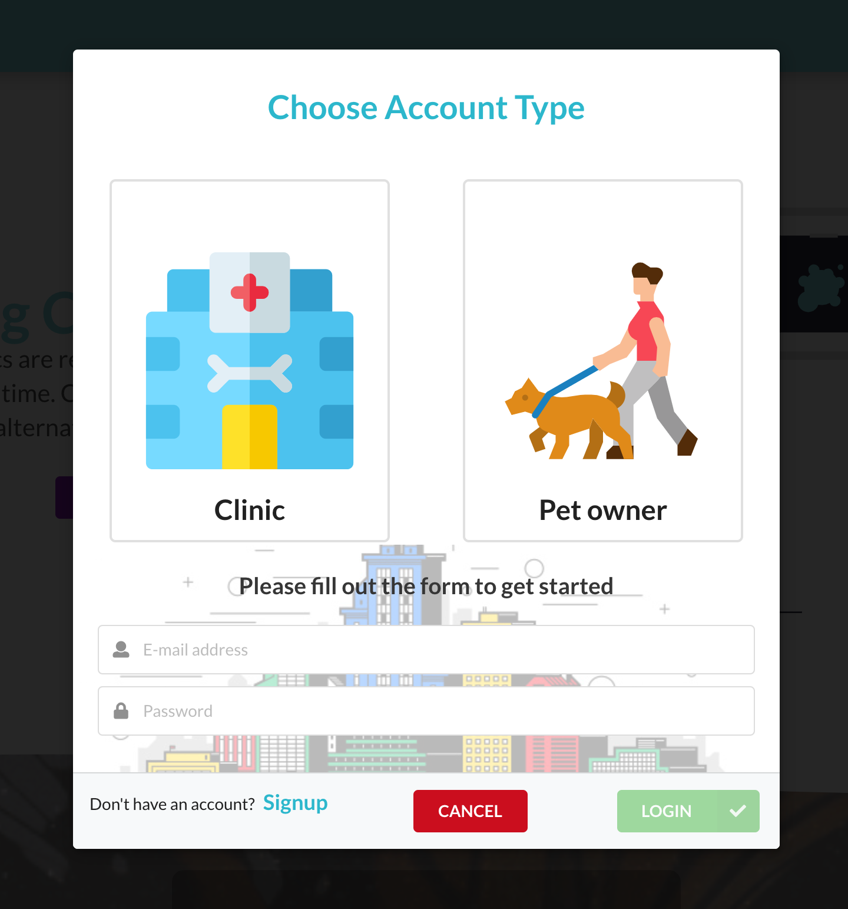
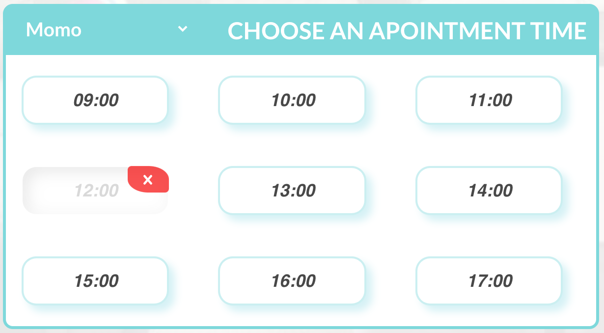
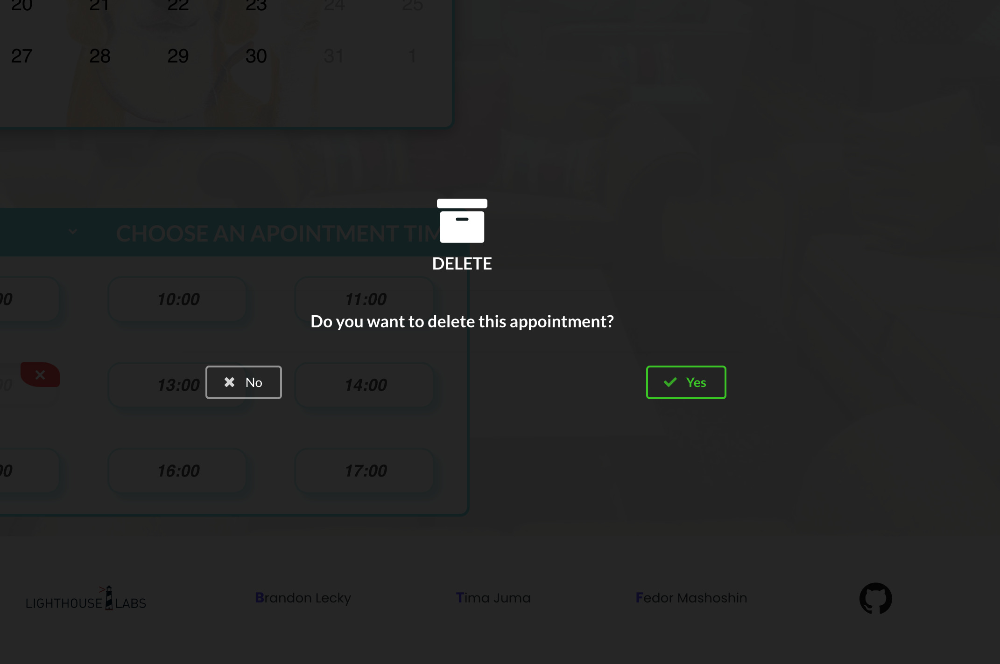
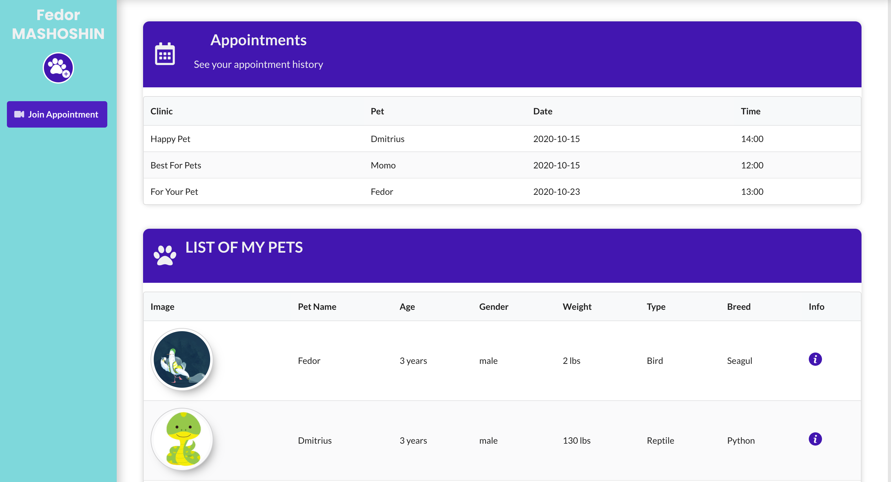

# Virtual Vet Application (aka PawBulance)

In the post pandemical world our App helps to connect Vet clinics and patients(pets).  
Within this App you can register as 
-  pet owner (client)
-  clinic (doctor)

Each account has its own dasboard containing information about pets and appointments.

## ▶️ Clone this repo and run:

### `npm start`

Runs the app in the development mode.
Open [http://localhost:3000](http://localhost:3000) to view it in the browser.

# Features of our App:

## Logging in with client account. ⬇️

1.  Searching for vet clinic by:

- Clinic name
- Location
- By pet type

2. Book an appointment with any clinic.
   

3. Delete an appointment if needed.
   
   

4. Chat, built with Web Sockets.
   

5. View all your appointments in user-dashboard.
   

6. Adding new pet.
   

## Logging in with clinic account. ⬇️

1. All information can be found in the dasboard.
   

2. Video chat with patient.
   
